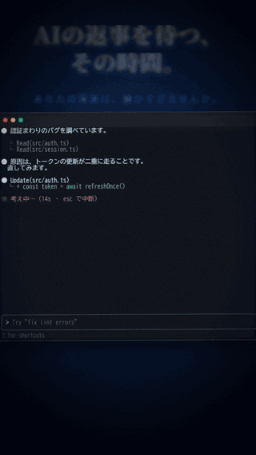
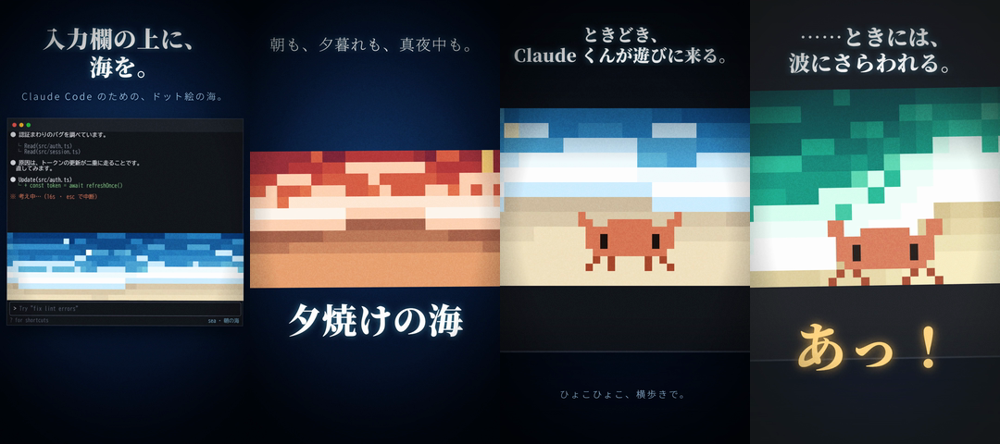

# sea — Claude Code の入力欄に、海を。

AI の返事を待つあいだ、入力欄の上で、真上から見下ろした浅瀬の波がゆっくり寄せては返します。
朝も、夕焼けも、真夜中も。ときどき、Claude くんが砂浜に遊びに来ます。

> **非公式の個人制作です。** Anthropic とは関係ありません。「Claude」は Anthropic の商標です。





PV (縦 9:16・30 秒。日本語版 / English): [Releases](https://github.com/himazintom/claude-code-sea/releases/latest) から

## 特徴

- **ドット絵の海** — 入力欄の真上に 12 行の帯。1 ドットは横 2 桁 × 縦 1 行で、ほぼ正方形の粗いドット絵です。
- **波は 1 つずつ別物** — 間隔・大きさ・勢い・引く長さがばらつき、周期的には見えません。潮の満ち引きで波打ち際も固定されません。手前へ一気に襲いかかり、すぐ引き始めます。
- **5 つの場面** — 朝、エメラルド、夕焼け、真夜中、明け方が、96 秒ごとにゆっくり溶け合って巡ります。固定もできます。
- **波の音 (Windows)** — 画面と同じ波・潮位・場面に合わせて合成する、自然のホワイトノイズ。大波では大きく、潮が引くと遠く、夜は低く静かに。
- **ときどき遊びに来る** — Claude くん (蟹のように横歩き)、波にさらわれる Claude くん、ウミガメ、魚の群れ、カモメの影、流れ星 (夜だけ)、小舟、波が引くと砂浜に現れる貝殻とヒトデ。
- **全セッション共通** — 場面・音・呼び出した動くものは、開いているすべてのセッションで揃います。
- **静か** — 通知なし、ネット接続なし。入力欄からキーを奪いません。

## 動作環境

| | |
| --- | --- |
| Claude Code | モッド (hooks module) に対応した版。動作確認: デスクトップアプリ同梱の 2.1.286 |
| 表示 | 端末 (トゥルーカラー対応) / デスクトップアプリ (SVG で描画) |
| 音 | **Windows のみ** (Windows PowerShell 5.1 の `System.Media.SoundPlayer`)。macOS / Linux は絵だけが出ます |

## インストール

### A. マーケットプレイスから (推奨)

```
claude plugin marketplace add himazintom/claude-code-sea
claude plugin install sea@claude-code-sea
```

Claude Code の中なら `/plugin` からも追加できます。更新は `claude plugin marketplace update claude-code-sea` です。

### B. 手動

```
git clone https://github.com/himazintom/claude-code-sea
```

そのフォルダを、次のどちらかで読み込みます。

- 起動のたびに指定: `claude --plugin-dir <clone したフォルダ>`
- 常時読み込む: `~/.claude/settings.json` の `env` に書く

```json
{
  "env": { "CLAUDE_CODE_PLUGIN_DIRS": "C:\\path\\to\\claude-code-sea" }
}
```

どちらでも、新しく始めたセッションから入力欄の上に海が出ます。出ないときは `/sea` を打ってください。

## 使い方

| コマンド | 内容 |
| --- | --- |
| `/sea` | このセッションの表示を切り替える (音は止まりません) |
| `/sea morning` `noon` `dusk` `night` `dawn` | 場面を固定する (全セッション共通) |
| `/sea auto` | 場面を自動で巡らせる |
| `/sea crab` `swept` `turtle` `fish` `gull` `meteor` `boat` `shell` | 今すぐ呼ぶ。`swept` は波にさらわれる Claude くん |
| `/sea sound` `on` `off` `0-100` | 波の音の切り替え・音量 (全セッション共通) |
| `/sea sync <ms>` | 音を画面の波より遅らせる量。音が先走って聞こえたら増やす (既定 120) |
| `/sea status` | 表示・音・プレーヤー・セッション数・状態の置き場を表示 |

## 仕組みと安全性

- **ネット接続はしません。** 書き込むのは `~/.claude/sea-state/` だけです (`control.json`、`schedule.json`、`player.alive`、`player.log`、`sessions/`)。
- **フックは最小限です。** 入力欄の上 (`AbovePrompt`) の描画、`/sea` コマンド、そして海そのものへのクリックを拒否する `ui.focus` だけです。他のプラグインには触りません。
- **音は、隠れた PowerShell プロセスが 1 つだけ鳴らします。** このリポジトリの `sound/sea-sound.ps1` だけを `-ExecutionPolicy Bypass` で実行します (ASCII のみ・約 350 行で、読めます)。どのセッションにも属さない常駐で、`/sea sound off` で止まり、開いているセッションがなくなって 30 秒後に自分で終了します。複数のセッションがあっても Mutex で 1 つしか鳴りません。
  - セキュリティソフトが「PowerShell を隠して起動した」と警告することがあります。気になる場合は `/sea sound off` で音を切れば、プロセスは起動しません。
- **画面と音は同じ予定表から作ります。** 波の予定表 (96 秒に 16 波) と潮位を `schedule.json` として渡し、音もそれに合わせて合成するので、絵で大波が寄せる瞬間に音も盛り上がります。生成が遅れた場合は、波の位相に合わせて途中から再生します。
- **描画は軽いです。** 1 フレーム 1.5 ミリ秒以内 (最悪ケース) で、12fps で動きます。

## トラブルシュート

| 症状 | 確認 |
| --- | --- |
| 海が出ない | `/sea` で表示を切り替える。端末の高さが足りないと (帯に使える行が 4 行未満)、出ません |
| 音が出ない | `/sea status` で「プレーヤー」が稼働中か見る。`~/.claude/sea-state/player.log` に経過が出ます。Windows 以外では音は出ません |
| 音が画面と合わない | `/sea sync 300` のように変える (大きいほど音が遅れる) |
| 古い設定が残る | `~/.claude/sea-state/` を削除してから、新しいセッションを開く |

## アンインストール

1. `/sea sound off` で音を止める。
2. マーケットプレイスなら `claude plugin uninstall sea@claude-code-sea`。手動なら `settings.json` の `env` を戻す。
3. 不要なら `~/.claude/sea-state/` を削除する。

## 既知の制限

- 音は Windows のみです。
- 絵は 12 行までです (入力欄の上に使える行数の半分が上限)。
- macOS / Linux での表示は未確認です。
- 海をクリックしても入力欄からキーを奪わないようにしていますが (`ui.focus` で拒否)、実際のクリックでの挙動の確認は十分ではありません。クリックして入力できなくなったり、動きが止まったりしたら、Issue で教えてください。

## ライセンス

[MIT](LICENSE)

---

## English summary

**sea** is an unofficial Claude Code mod that draws a calm, pixel-art, top-down view of shallow waves right above the prompt, with irregular waves and tides, five scenes (morning, emerald, sunset, midnight, dawn) that drift into each other, optional wave sounds (Windows only), and small visitors: a crab-like orange character that scuttles along the beach (and sometimes gets swept away), a sea turtle, fish shadows, a gull's shadow, shooting stars, a boat, and shells that appear when the water pulls back.

- Install: `claude plugin marketplace add himazintom/claude-code-sea` then `claude plugin install sea@claude-code-sea`, or clone and load the folder with `claude --plugin-dir` / `CLAUDE_CODE_PLUGIN_DIRS`.
- Commands: `/sea`, `/sea <scene>`, `/sea auto`, `/sea <crab|swept|turtle|fish|gull|meteor|boat|shell>`, `/sea sound [on|off|0-100]`, `/sea sync <ms>`, `/sea status`.
- Sound uses one hidden Windows PowerShell process running `sound/sea-sound.ps1`; it exits when every session is closed. No network access. Writes only to `~/.claude/sea-state/`.
- Not affiliated with Anthropic. "Claude" is a trademark of Anthropic.
